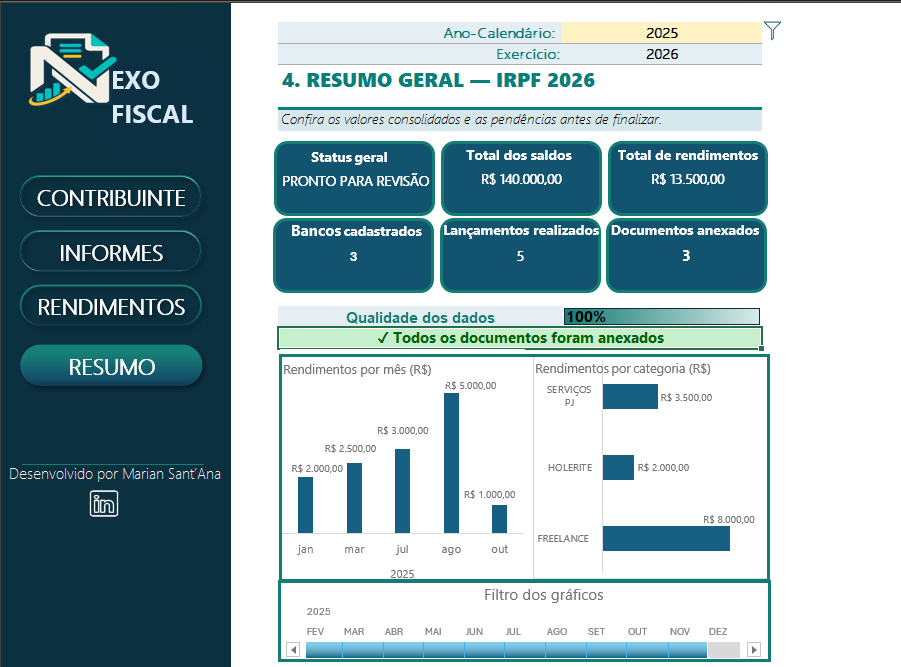
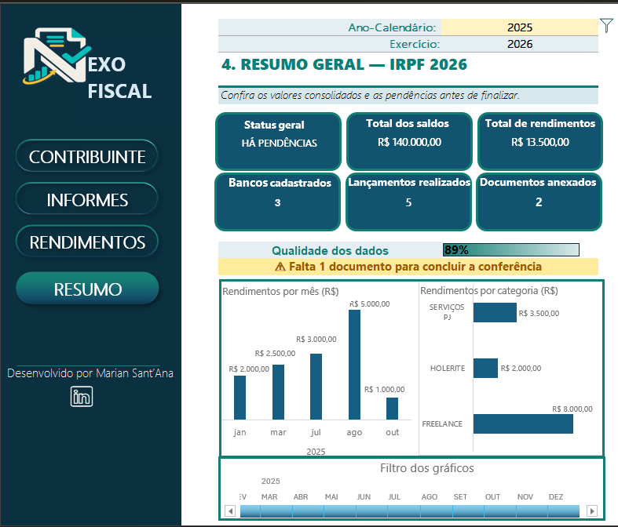
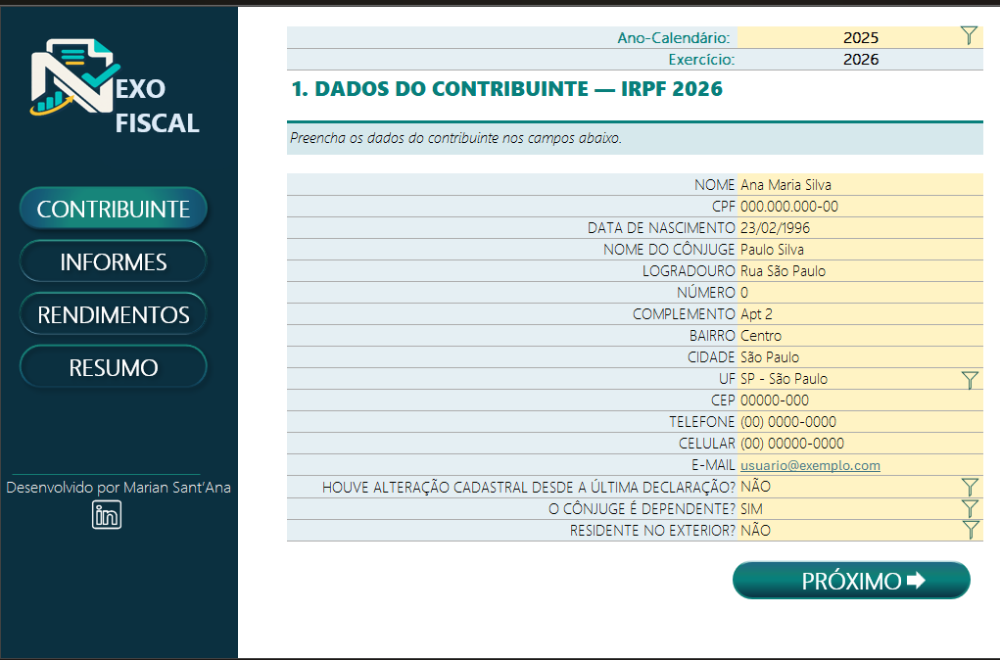
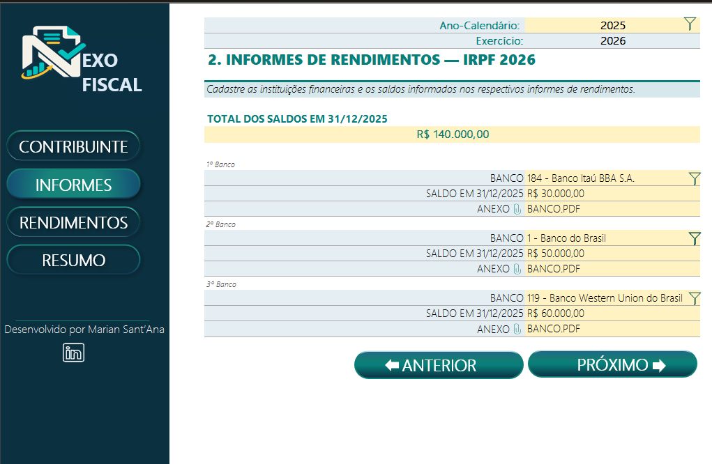
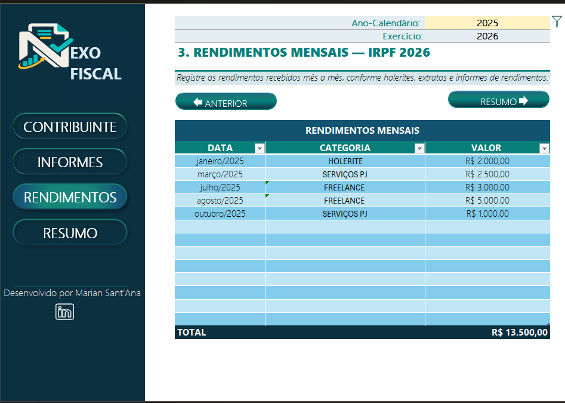
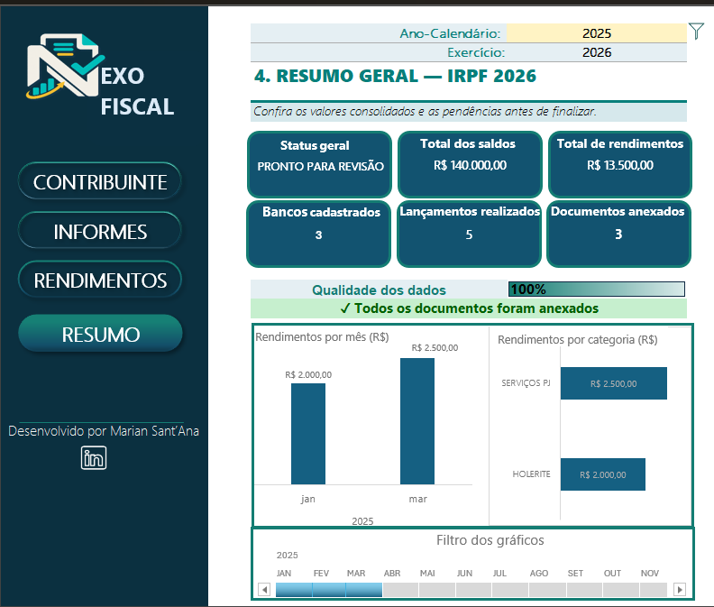

# Nexo Fiscal — Organizador de Dados para IRPF

## Sobre o projeto

O **Nexo Fiscal** é uma ferramenta desenvolvida no Microsoft Excel para organizar informações essenciais relacionadas à declaração do Imposto de Renda da Pessoa Física.

A solução reúne dados cadastrais, informes bancários, documentos e rendimentos mensais em uma interface integrada, com navegação entre telas, validações automáticas, indicadores de qualidade e um painel visual para acompanhamento das informações.

Este projeto foi desenvolvido durante o **Bootcamp Santander — Excel com Inteligência Artificial**, realizado pelo **Santander Open Academy em parceria com a DIO**.

O desafio-base e os conceitos iniciais foram apresentados pelo professor **Felipe Silva Aguiar**. A partir dessa proposta, desenvolvi uma versão autoral, com nova identidade visual, estrutura ampliada, controles de qualidade e recursos de análise de dados.

> Os dados apresentados na planilha e nas imagens são fictícios e foram utilizados exclusivamente para demonstração.

## Objetivo

Criar uma ferramenta prática e visual que ajude o usuário a:

* centralizar dados necessários para a declaração;
* organizar instituições financeiras e informes bancários;
* registrar rendimentos ao longo do ano;
* identificar documentos faltantes;
* acompanhar o nível de completude das informações;
* visualizar os dados por mês e por categoria;
* reduzir erros de preenchimento com validações automáticas.

## Diferenciais desenvolvidos

O projeto-base foi utilizado como ponto de partida para aplicar os conceitos apresentados no bootcamp. Na versão **Nexo Fiscal**, foram acrescentados recursos próprios para ampliar a usabilidade, a análise e a identidade da solução.

### Identidade visual autoral

* criação do nome **Nexo Fiscal**;
* logotipo personalizado;
* paleta em azul-petróleo, verde-azulado, branco e dourado;
* menu lateral padronizado;
* botões de navegação entre as telas;
* indicação visual da página ativa;
* assinatura da desenvolvedora;
* ícone clicável direcionando para o LinkedIn.

### Período fiscal dinâmico

* seleção do ano-calendário por lista;
* cálculo automático do exercício seguinte;
* atualização dos títulos conforme o exercício escolhido;
* identificação do período utilizado em todas as telas.

### Cadastro e validação de dados

* campos organizados para dados do contribuinte;
* validações por listas suspensas;
* seleção de estado;
* respostas padronizadas de “Sim” e “Não”;
* campos de endereço reorganizados;
* link de e-mail clicável;
* destaque visual para campos de entrada.

### Informes bancários

* seleção das instituições financeiras;
* registro dos saldos em 31 de dezembro;
* totalização automática dos saldos;
* área para anexos dos informes;
* contagem automática dos bancos cadastrados;
* contagem dos documentos anexados.

### Rendimentos mensais

* tabela estruturada denominada `tbRendimentos`;
* registro por data, categoria e valor;
* categorias padronizadas, como holerite, freelance e serviços PJ;
* totalização automática dos rendimentos;
* filtros nos cabeçalhos;
* atualização da tabela com novos lançamentos.

### Dashboard de resumo

Foi criada uma aba adicional de **Resumo Geral**, não limitada às telas do modelo-base, reunindo os principais indicadores:

* status geral;
* total dos saldos bancários;
* total dos rendimentos;
* número de bancos cadastrados;
* quantidade de lançamentos;
* quantidade de documentos anexados.

### Qualidade e completude dos dados

O dashboard também possui um controle dinâmico de qualidade:

* cálculo percentual da completude documental;
* identificação da quantidade de documentos pendentes;
* mensagem automática de alerta;
* mudança de cor por formatação condicional;
* alteração do status para “Pronto para revisão” quando as condições são atendidas.

Quando falta um documento, o sistema apresenta um aviso amarelo. Quando todos os documentos são anexados, o indicador chega a 100% e a mensagem passa para verde.

### Análise visual

Foram acrescentados:

* gráfico de rendimentos por mês;
* gráfico de rendimentos por categoria;
* Tabelas Dinâmicas como origem das análises;
* rótulos monetários;
* Linha do Tempo para filtrar os gráficos;
* conexão do mesmo filtro aos dois gráficos;
* atualização dos relatórios por meio do comando “Atualizar Tudo”.

## Demonstração das validações

|                       Pendência identificada                      |                          Documentação completa                         |
| :---------------------------------------------------------------: | :--------------------------------------------------------------------: |
|  |  |

## Principais telas

### Dados do contribuinte

### Informes bancários

### Rendimentos mensais

### Filtros interativos

## Estrutura da planilha

| Aba          | Finalidade                                          |
| ------------ | --------------------------------------------------- |
| CONTRIBUINTE | Cadastro e validação dos dados pessoais             |
| INFORMES     | Registro das instituições, saldos e documentos      |
| RENDIMENTOS  | Lançamento mensal dos rendimentos                   |
| RESUMO       | Indicadores, qualidade dos dados e análises visuais |
| APOIO        | Listas, cálculos auxiliares e Tabelas Dinâmicas     |

## Recursos utilizados

* Microsoft Excel;
* tabelas estruturadas;
* Tabelas e Gráficos Dinâmicos;
* Linha do Tempo;
* validação de dados;
* listas suspensas;
* intervalos nomeados;
* fórmulas condicionais;
* formatação condicional;
* referências entre planilhas;
* hiperlinks;
* indicadores de desempenho;
* controle de qualidade dos dados.

## Como utilizar

1. Abra `Nexo_Fiscal_Demonstracao.xlsx`.
2. Escolha o ano-calendário.
3. Preencha os dados do contribuinte.
4. Cadastre as instituições financeiras e os respectivos saldos.
5. Adicione os informes bancários.
6. Registre os rendimentos mensais.
7. Acesse a aba RESUMO.
8. Clique em **Dados → Atualizar Tudo** para atualizar as análises.
9. Utilize a Linha do Tempo para filtrar os gráficos.
10. Confira o percentual de completude e as pendências.

## Download

[Baixar a planilha Nexo Fiscal](./Nexo_Fiscal_Demonstracao.xlsx)

## Aprendizados

O desenvolvimento do Nexo Fiscal permitiu aplicar conhecimentos de organização, padronização, validação e visualização de dados no Excel.

Além da construção da interface, o projeto exigiu atenção à estrutura dos dados, à classificação correta dos rendimentos, à conexão entre tabelas e gráficos, à criação de indicadores e ao tratamento de situações incompletas.

A principal evolução em relação ao exemplo inicial foi transformar um agregador de informações em uma ferramenta com características de dashboard, controle de qualidade e análise interativa.

## Créditos

Projeto desenvolvido durante o **Bootcamp Santander — Excel com Inteligência Artificial**, realizado pelo **Santander Open Academy em parceria com a DIO**.

Desafio-base e orientação: **Felipe Silva Aguiar**.

Desenvolvimento, identidade visual, personalizações e funcionalidades adicionais: **Marian Sant’Ana**.

## Observação

Este projeto possui finalidade exclusivamente educacional e demonstrativa. Ele não substitui os sistemas oficiais da Receita Federal nem a orientação de profissionais habilitados.

---

Desenvolvido por **Marian Sant’Ana**.

